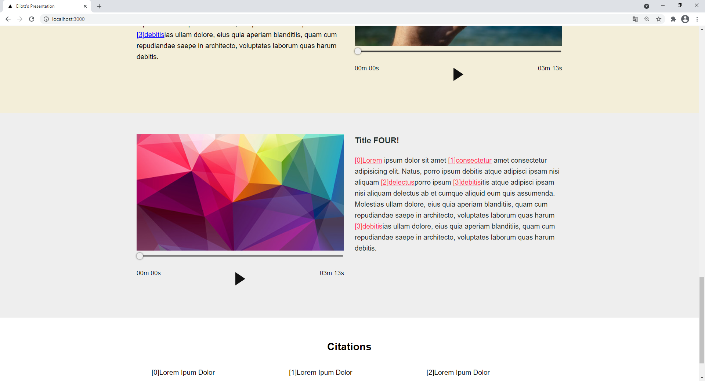

Presentation project for my boyfriends class!

# Presentation Web App in React

Custom audio track controllers, responsive images and columns on top of smooth scroll and state management without Redux using pure CSS for styling.



Run Locally
```
> git clone github.com/M-Daley/responsive_react
> npm run start
```

or

Check out my [website](www.mdaley.dev) for this and similar samples live.